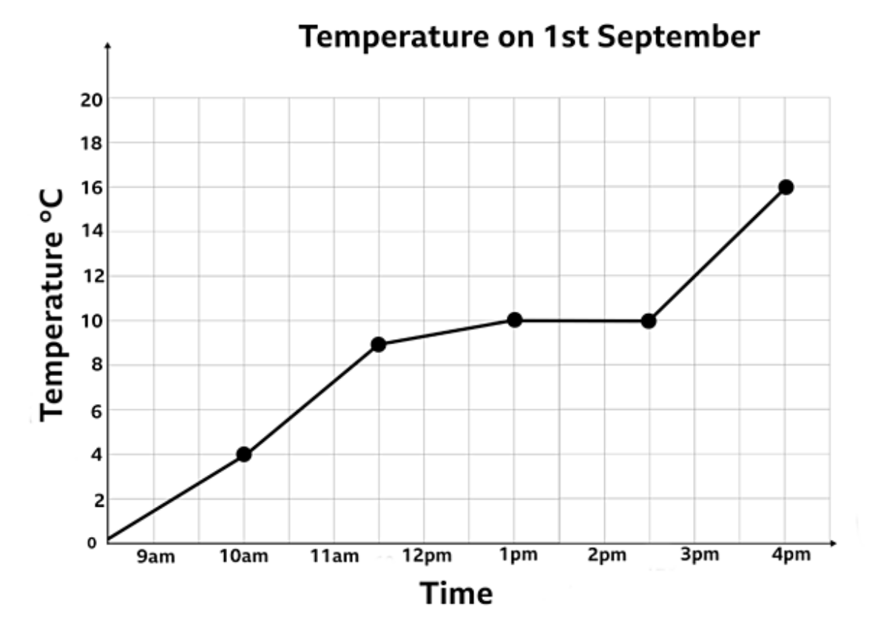

# How To Create A Bar Chart

## Introduction

What is a line chart? A line chart depicts the changes in values over a certain set of variables on the x-axis. The x-axis is using a measure of time (days, months, years). This is an example of a typical line graph:

 

---

## Data We Will Use For This Tutorial

Since it is the holiday season, we will be looking at data involving christmas trees. Some people choose to get a real Christmas tree, while other prefer to use a fake one. We will be looking at the total number of trees sold, the number of fake trees sold, and the number of real trees sold throughout the years.  

---

## How To Start

You will need to install the packages that you will be using. You already may have some of these installed, so if you do it is unnecessary to install them again.

Use install.packages() to install a package. We will be using tidyverse, ggplot2, and readr

Then, you will need to load the libraries of these packages.

```{r}
# Libraries
library(tidyverse)
library(ggplot2)
library(readr)
```

Next you will need to load the tree data that we will be using to make the line charts:
```{r}
Tree_Data <- read.csv("Christmas_Tree.csv") # Loading Tree Data
```

--- 

# Make a simple line chart with real trees sold

We will be using a package called ggplot to make our line graphs. This package helps us to visualize data. After ggplot, we will put the data we will be using (Tree_Data). Next we will use aes which is the aesthetic mapping function. This will allow us to say what data we want to put on the x-axis and the y-axis. We will put a plus sign and then geom_line() to make the line graph. 

```{r}
ggplot(Tree_Data, aes(x=Year, y=X._real_trees_sold)) + # Year is on the X-axis, Real trees sold is on the y axis
  geom_line() # Makes it a line chart
```

# Add the fake trees line and total trees line

Next, we will add the lines for the fake trees sold and the total tree sold over the years. 

```{r}
ggplot(Tree_Data, aes(x=Year)) +
  geom_line(aes(y = X._real_trees_sold)) + # Line for real trees sold
  geom_line(aes(y = X._fake_trees_sold)) + # Line for fake trees sold
  geom_line(aes(y = total_trees_sold)) # Line for total trees sold
```

# Add a title

Next, we will add a title for the graph.

```{r}
ggplot(Tree_Data, aes(x=Year)) +
  geom_line(aes(y = X._real_trees_sold)) + # Line for real trees sold
  geom_line(aes(y = X._fake_trees_sold)) + # Line for fake trees sold
  geom_line(aes(y = total_trees_sold)) + # Line for total trees sold
  ggtitle("Trees Sold Over Time") # Title
```

# Add axis labels

Next, we will add appropriate axis labels. 
```{r}
ggplot(Tree_Data, aes(x=Year)) +
  geom_line(aes(y = X._real_trees_sold)) + # Line for real trees sold
  geom_line(aes(y = X._fake_trees_sold)) + # Line for fake trees sold
  geom_line(aes(y = total_trees_sold)) + # Line for total trees sold
  ggtitle("Trees Sold Over Time") + # Title
  labs(y = "Number of Trees Sold", x = "Year") # Y and x labels
```


## Adding Colors To The Lines
In order to differentiate what the different lines are showing, we will want to make the lines different colors. In honor of the holiday season, we will be using Christmas colors: gold, green, and red. 

In order to find the colors I wanted, I just googled colors to use in ggplot in R. This is the link I found: http://sape.inf.usi.ch/quick-reference/ggplot2/colour

Here are some of the color options:


